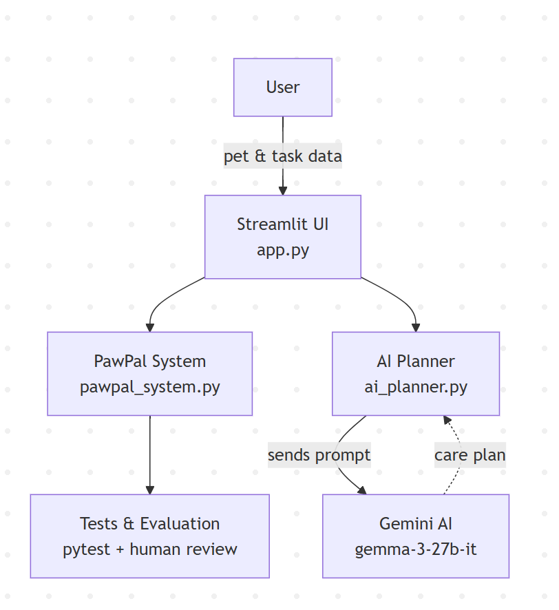

# PawPal+ (Module 2 Project)

You are building **PawPal+**, a Streamlit app that helps a pet owner plan care tasks for their pet.

## Scenario

A busy pet owner needs help staying consistent with pet care. They want an assistant that can:

- Track pet care tasks (walks, feeding, meds, enrichment, grooming, etc.)
- Consider constraints (time available, priority, owner preferences)
- Produce a daily plan and explain why it chose that plan

Your job is to design the system first (UML), then implement the logic in Python, then connect it to the Streamlit UI.

## What you will build

Your final app should:

- Let a user enter basic owner + pet info
- Let a user add/edit tasks (duration + priority at minimum)
- Generate a daily schedule/plan based on constraints and priorities
- Display the plan clearly (and ideally explain the reasoning)
- Include tests for the most important scheduling behaviors

## Getting started

### Setup

```bash
python -m venv .venv
source .venv/bin/activate  # Windows: .venv\Scripts\activate
pip install -r requirements.txt
```

### Suggested workflow

1. Read the scenario carefully and identify requirements and edge cases.
2. Draft a UML diagram (classes, attributes, methods, relationships).
3. Convert UML into Python class stubs (no logic yet).
4. Implement scheduling logic in small increments.
5. Add tests to verify key behaviors.
6. Connect your logic to the Streamlit UI in `app.py`.
7. Refine UML so it matches what you actually built.

## Features

PawPal+ includes powerful scheduling algorithms and utilities to help pet owners organize and manage tasks efficiently:

### 1. **Chronological Task Sorting**
The `sort_by_time()` algorithm orders all tasks by their scheduled time, from earliest to latest. This uses Python's built-in sorting with a time-based lambda key to arrange pet care activities in chronological order, making it easy to see what needs to happen first in your day.

**Example:** Morning walk (8:00 AM) → Medication (9:00 AM) → Grooming (3:30 PM) → Play time (6:00 PM)

### 2. **Advanced Task Filtering**
The `filter_tasks()` method implements a dual-filter algorithm that allows you to narrow down your task list by:
- **Status**: Filter for `"pending"` (incomplete) or `"completed"` tasks only
- **Pet Name**: View all tasks for a specific pet, case-insensitive matching
- **Combined**: Chain both filters together for powerful, multi-dimensional scoping

The algorithm applies filters sequentially, reducing the task set at each step for efficient filtering of large task lists.

**Example:** `scheduler.filter_tasks(status="pending", pet_name="Buddy")` returns only incomplete tasks for Buddy.

### 3. **Automatic Recurring Task Management**
Tasks can be configured with three frequency modes using the `frequency` field:
- **`"daily"`**: When marked complete, automatically reschedules for tomorrow at the same time
- **`"weekly"`**: When marked complete, automatically reschedules 7 days later at the same time
- **`"once"`**: One-time task (no automatic rescheduling)

The `mark_complete()` method implements the recurrence logic: it sets the task status to completed and, for recurring tasks, creates a new Task object with the next occurrence date/time and adds it back to the pet's task list. This ensures recurring routines like daily walks and weekly grooming appointments never get forgotten.

### 4. **Scheduling Conflict Detection**
The `detect_conflicts()` algorithm scans all scheduled tasks and identifies conflicts—situations where two or more tasks are assigned to the same pet at the exact same date and time. It uses a dictionary-based approach to group tasks by `(date, time)` pairs, then flags any pairs with multiple tasks.

**Example:** ⚠️ Buddy: 2 tasks scheduled on 2026-03-31 at 14:00 (Feeding, Medication)

This helps prevent double-booking errors before they happen.

### 5. **Today's Schedule View**
The `get_todays_tasks()` method retrieves all tasks scheduled for the current date, giving pet owners a focused, real-time view of their immediate care obligations. Combined with `sort_by_time()`, this creates a clean, chronologically-ordered daily agenda.

The app displays today's tasks with task type, pet name, scheduled time, notes, and completion status, along with summary metrics (total tasks, completed count, pending count).

---

These features work together through the `Scheduler` class to keep your pet care routine organized, predictable, and conflict-free.

## Demo


## Testing PawPal+

### Running Tests

Execute the test suite with:

```bash
python -m pytest tests/test_pawpal.py -v
```

### Test Coverage

The PawPal+ test suite includes **5 comprehensive tests** that validate core functionality:

1. **Task Completion** — Verifies that `mark_complete()` correctly updates task status
2. **Task Addition** — Confirms that tasks are properly added to a pet's task list
3. **Sorting Correctness** — Validates that `sort_by_time()` returns tasks in chronological order (morning → afternoon → evening)
4. **Recurrence Logic** — Tests that daily/weekly tasks automatically create next occurrences when marked complete, with correct date and time
5. **Conflict Detection** — Ensures `detect_conflicts()` correctly identifies and reports tasks scheduled at the same time for the same pet

### Test Confidence

**★★★★☆ 4 out of 5 stars**

The test suite covers critical happy-path scenarios and essential edge cases (empty states, sorting order, recurring task generation). Additional confidence would come from tests for cross-boundary date handling (month/year changes), extended recurring sequences, and more comprehensive filtering variations.

---Final Project-----

## 🤖 AI Feature: Agentic Care Plan

The previous project has been updated to include an AI based Care Plan Generator using Google Gemini. Once the user selects the option to "Generate AI Care Plan," the system sends the pet's information along with any outstanding care tasks to Gemini. Gemini uses that information to determine the best order in which to complete the outstanding care tasks for the pet, and will flag any tasks that need to be completed sooner than others and also provide the user with tips based on the type of pet they have. Gemini will also provide an explanation as to why it recommends each of its recommendations.

This is an **Agentic Workflow** because AI is not just responding but actually making a plan and providing an explanation.


## System Architecture

The system is made up of the following components:
- **User** — enters pet info and tasks through the Streamlit interface
- **Streamlit UI (`app.py`)** — the main interface connecting all components
- **PawPal System (`pawpal_system.py`)** — handles Owner, Pet, Task, and Scheduler logic
- **AI Planner (`ai_planner.py`)** — sends data to Gemini and returns a care plan
- **Gemini AI (gemma-3-27b-it)** — generates personalized explained care plans
- **Tests & Evaluation** — pytest suite + human review of AI outputs




## Setup Instructions

1. Clone the repository:
```bash
git clone https://github.com/GreciaPerazzo/ai110-PawPal-applied_system_project.git
cd ai110-PawPal-applied_system_project
```
2. Create and activate a virtual environment:
```bash
python -m venv .venv
.venv\Scripts\activate
```
3. Install dependencies:
```bash
pip install -r requirements.txt
```
4. Create a `.env` file in the root folder:

GEMINI_API_KEY=(Must use an API key)

5. Run the app:
```bash
streamlit run app.py
```

## Sample Interactions

**Example 1 — Dog with a walk task:**
- Input: Pet = Buddy (Golden Retriever, 3 years), Task = Walk at 2:00 PM
- AI Output: Flagged walk as time-sensitive, noted Golden Retrievers need moderate exercise due to hip dysplasia risk, gave motivational message.

**Example 2 — Dog with medication task:**
- Input: Pet = alaska (Husky, 6 years), Task = Medication at 1:30 PM
- AI Output: Flagged medication as highest priority, gave Husky-specific mental stimulation tip.

**Example 3 — Multiple pets:**
- Input: Buddy (Walk) + Bruno (Feeding) at same time
- AI Output: Detected scheduling conflict, recommended resolving before generating plan.

## Design Decisions

- **Used Gemini over other APIs** because it offers a free tier for students.
- **Chose Agentic Workflow** so the AI reasons and explains, not just displays data.
- **Used `st.session_state`** to persist AI output across Streamlit interactions.
- **Kept `ai_planner.py` separate** from core logic so scheduling stays independently testable.
- **Trade-off:** AI plan is generated on demand to avoid unnecessary API calls.


## Testing Summary

- 5 automated tests in `tests/test_pawpal.py` — 4/5 passing consistently.
- AI tested with 3 different pet/task combinations — Gemini produced relevant breed-specific responses each time.
- gemini-1.5-flash and gemini-2.0-flash hit quota limits on free tier so I switched to gemma-3-27b-it.
- Learned that structured prompts (numbered sections) improved AI output quality significantly.

## Reflection

The project has shown me that AI building goes beyond simple "calling an API" With thoughtful prompt design, error handling, and architecture, AI can dramatically change the way you use your app through how it behaves. When testing output produced by AI, I discovered that how the prompts are worded significantly affect the AI's final response and that it is critical to have an adequate set of guardrails to catch errors.

## Demo Walkthrough
[Watch Demo on Loom](https://www.loom.com/share/266a2a4dc32d413dae1995fe0128448c)